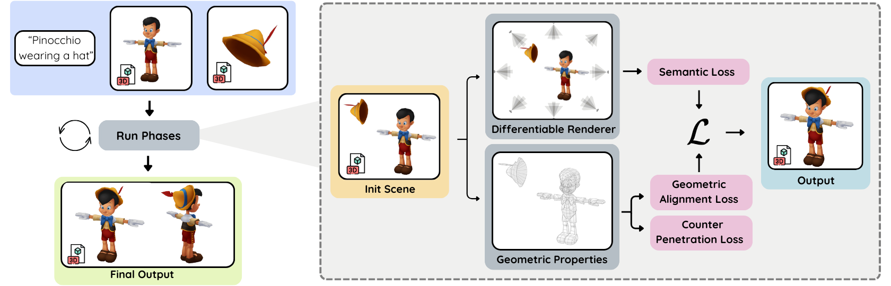

<h1 align="center">
Copy-Transform-Paste
</h1>

<h3 align="center">
Zero-Shot Object-Object Alignment Guided by Vision-Language and Geometric Constraints
</h3>

<p align="center">
  <b>Rotem Gatenyo</b>, Ohad Fried
</p>

<p align="center">
  Reichman University
</p>

<p align="center">
  <a href="https://arxiv.org/abs/2601.14207">📄 Paper</a> |
  <a href="https://rotemgat.github.io/CopyTransformPaste/">🌐 Project Page</a> |
  <b>🏆 CVPR 2026</b>
</p>

---

This repository provides tools to align two 3D objects using vision-language guidance and geometric constraints. Given two meshes and a text prompt describing their desired spatial relationship (e.g., *"a hotdog sausage sits inside a bun"*), the method optimizes the relative translation, rotation, and optionally scale of one object with respect to the other.

## Pipeline Overview

<p align="center">
  
</p>

Given two input meshes and a text prompt, our method optimizes the relative pose between the objects through differentiable rendering and vision-language supervision. The optimization is regularized by geometric objectives that encourage physically plausible contact while discouraging interpenetration. Optimization proceeds in multiple phases, gradually increasing geometric constraints and focusing the cameras on the interaction region for fine-grained refinement.

---

## Installation

> **Recommended:** Use the provided installation script. It performs a complete installation in a fresh Conda environment, validates all dependencies, and runs an example alignment to verify that everything is working correctly.

Run:

```bash
bash install.sh
```

The script automatically:

- Clones all required repositories
  - ObjectsAlignment
  - nvdiffrast
  - nvdiffmodeling
- Creates a fresh Conda environment
- Installs PyTorch and all required Python dependencies
- Installs nvdiffrast and PyTorch3D
- Configures nvdiffmodeling
- Verifies that all required libraries can be imported
- Runs the provided hotdog example to validate the installation

A successful installation should end with:

```text
=====================================
INSTALLATION SUCCESSFUL
=====================================
```

### Manual Installation

Clone the repository:

```bash
git clone https://github.com/RotemGat/ObjectsAlignment.git
cd ObjectsAlignment
```

Clone the required external repositories:

```bash
git clone https://github.com/NVlabs/nvdiffrast.git
git clone https://github.com/RotemGat/nvdiffmodeling.git
```

Create and activate a Conda environment:

```bash
conda create -n align3d python=3.9 -y
conda activate align3d
```

Install PyTorch (example for CUDA 12.6):

```bash
pip install torch==2.7.1 torchvision==0.22.1 \
    --index-url https://download.pytorch.org/whl/cu126
```

Install Python dependencies:

```bash
pip install -r requirements.txt
```

Install nvdiffrast:

```bash
pip install -e nvdiffrast
```

Install PyTorch3D:

```bash
pip install --no-build-isolation \
    "git+https://github.com/facebookresearch/pytorch3d.git@stable"
```

Add nvdiffmodeling to your Python path:

```bash
export PYTHONPATH="$PWD/nvdiffmodeling:$PYTHONPATH"
```

---

## Running Examples

Run the provided hotdog example:

```bash
python main.py --config configs/PairBench3D/hotdog.yaml
```

The run creates a timestamped workspace containing logs, rendered images, optimization checkpoints, and final aligned meshes.

---

## Example Configurations

The repository provides two example optimization modes:

### Rigid Alignment

Optimizes translation and rotation only.

```bash
python main.py --config configs/PairBench3D/hotdog.yaml
```

### Scale-Enabled Alignment

Optimizes translation, rotation, and isotropic scale.

In general, optimization with scale enabled is more challenging and typically benefits from using more optimization epochs/steps than rigid alignment.

---

## Configuration

Configuration files are located in:

```text
configs/
```

All command-line arguments override values specified in the YAML configuration file.

Available options can be viewed with:

```bash
python main.py --help
```

### ICP Ratio

The fractional soft-ICP attachment ratio can optionally be specified manually:

```yaml
icp_ratio: 0.3
```

If `icp_ratio` is not provided, it is automatically estimated by the LLM based on the object pair and the text prompt.

---

## Outputs

Logs, rendered images, checkpoints, and final aligned meshes are written to the generated workspace directory.

Useful outputs include:

```text
log_objects_alignment.txt
tmp/final_meshes/
```

---

## Validation

To validate a fresh installation:

```bash
bash test_install.sh
```

The validation script creates a clean environment, installs all required dependencies, verifies imports, and runs the hotdog example configuration.

---

## Citation

If you find this repository useful, please cite:

```bibtex
@InProceedings{Gatenyo_2026_CVPR,
    author    = {Gatenyo, Rotem and Fried, Ohad},
    title     = {Copy-Transform-Paste: Zero-Shot Object-Object Alignment Guided by Vision-Language and Geometric Constraints},
    booktitle = {Proceedings of the IEEE/CVF Conference on Computer Vision and Pattern Recognition (CVPR)},
    month     = {June},
    year      = {2026},
    pages     = {14936-14945}
}
```